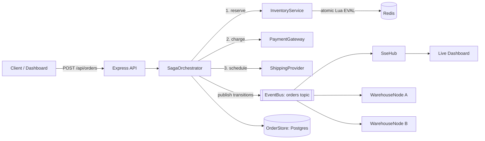

# Architecture

## Why this exists

Most student "supply chain management system" projects are CRUD over
suppliers/orders/inventory tables. This one is built around the two problems
that actually make supply chain and order-fulfillment systems hard at scale:

1. **Never oversell** — many customers can try to buy the last unit of a SKU
   at the same instant, across multiple app instances. A naive
   read-then-write check-then-decrement is a race condition.
2. **Never leave an order half-finished** — a multi-step fulfillment flow
   (reserve stock, charge payment, schedule shipping) can fail at any step,
   and every already-completed step needs to be unwound cleanly, without a
   distributed transaction coordinator across services that don't share a
   database.

## Components

## The reservation guarantee

`src/inventory/reserve.lua` runs as a single atomic operation on the Redis
server: check available stock, and if sufficient, decrement it and record a
reservation — all inside one `EVAL`. Because Redis executes Lua scripts
single-threaded, every concurrent caller (from any number of app instances,
each with its own connection) is serialized through that one check-and-
decrement, so it's structurally impossible for two reservations to both
succeed against the same last unit. `scripts/verify.ts` proves this directly:
500 concurrent reservation attempts against 50 units of stock accept exactly
50 and reject exactly 450, every time, from 10 independent connections
simulating 10 separate app instances.

Every reservation carries a TTL (`reserve.lua`'s `ARGV[3]`), so a crashed
order-service instance that reserved stock but never confirmed or released it
doesn't lock that stock forever — Redis expires the reservation key and the
next `release`/`commit` call against it becomes a safe no-op.

## The saga

`src/orders/sagaOrchestrator.ts` implements an **orchestration-style saga**:
one coordinator (`SagaOrchestrator.run`) calls each participant in sequence
and explicitly compensates already-completed steps if a later step fails.

| Step completed          | If a later step fails, compensation runs |
|--------------------------|-------------------------------------------|
| Inventory reserved        | `InventoryService.release()` — returns stock to the pool |
| Payment charged           | `PaymentGateway.refund()` |
| Shipping scheduled        | `ShippingProvider.cancel()` |

Compensations run in reverse order of completion, and every compensating
action is idempotent (`release.lua` is a no-op on an already-resolved
reservation; `refund()` is a no-op if nothing was charged), so a crash
mid-rollback and a subsequent retry can't double-refund or double-release.

Orchestration (vs. choreography, where services react to each other's events
with no central coordinator) was the right call here because the whole point
is a single order's audit trail being easy to reconstruct: `order.history` on
every `Order` is literally the saga's event log for that order.

## Multi-warehouse eventual consistency

`src/warehouse/warehouseSync.ts` models each warehouse as an independent node
consuming a shared stock-events log through its own consumer-group cursor —
the same mechanism Kafka consumer groups give you for free. A disconnected
node (simulating a network partition, a deploy, or an AZ outage) simply stops
advancing its cursor; on reconnect it replays every event it missed, in
order, and converges to the same state as every node that stayed connected,
with no event lost or double-applied.

## Swappable infrastructure, not fake infrastructure

Two seams keep this repo runnable in two very different environments without
touching business logic:

- **Redis**: `RedisLike` is implemented by `RawRespClient` (a ~150-line
  zero-dependency RESP client over `node:net`, used by default and by
  `scripts/verify.ts`) and by `IoRedisClient` (a thin wrapper over `ioredis`,
  used when `REDIS_DRIVER=ioredis`). Both talk to a real Redis server —
  there's no mock in the reservation path.
- **Events**: `EventBus` is implemented by `InMemoryEventBus` (real
  consumer-group semantics, in-process — what the test suite and
  `scripts/verify.ts` use) and by `KafkaEventBus` (a thin wrapper over
  `kafkajs`, used when `KAFKA_BROKERS` is set).

This is why the whole correctness story — no overselling, clean saga
rollback, multi-node convergence — can be verified with nothing but Node and
a local `redis-server`, while the same code path runs against real Kafka and
managed Redis in `docker-compose.yml` / production.

## Deployment topology (Kubernetes)

`k8s/base/app-deployment.yaml` runs the app with 2+ replicas by default —
not an arbitrary default, but the actual point of the project: the
no-oversell guarantee is only interesting if it holds *across* multiple
concurrently-running instances, which is exactly what
`tests/concurrency.load.test.ts` and `scripts/verify.ts`'s "multi-instance"
check exercise. Redis/Postgres/Kafka are network-isolated from everything
except the app tier via `NetworkPolicy`, Postgres and Kafka run as
`StatefulSet`s with their own `PersistentVolumeClaim`s (stable identity +
durable storage, unlike the interchangeable pods a `Deployment` gives you),
and the app's readiness probe checks real Redis connectivity so a pod with a
temporarily unreachable dependency is pulled out of Service rotation instead
of being killed and restarted. Full rundown in [`k8s/README.md`](../k8s/README.md).

## Multi-tenant scoping

Orders are the tenant-owned data in this system, so they're what got
partitioned. Every `Order` carries a `businessId: string | null`
(`src/types.ts`) — the logged-in business that created it, or `null` for an
order created without a session. `OrderStore.get()`/`all()`
(`src/orders/orderStore.ts`, `src/orders/pgOrderStore.ts`) take an optional
`businessId` argument with three distinct meanings:

| Call                          | Meaning |
|--------------------------------|---------|
| `get(id)` / `all()`            | Unscoped — the saga's and the recovery sweep's internal view. Not a request, so not scoped. |
| `get(id, businessId)`          | Only that business's own orders. |
| `get(id, null)`                | Only the shared anonymous/demo pool. |

`src/api/routes/orders.ts`'s `scopeFor(req)` is the only place an HTTP
request turns into one of the last two — it never calls the unscoped form.
That split matters for the same reason `InMemoryOrderStore` and
`PgOrderStore` both implement the exact same three-way contract
(`tests/multitenant.test.ts` covers the in-memory one,
`tests/pgOrderStore.test.ts` the Postgres one): ownership is an HTTP-layer
concept, and the saga orchestrator would be wrong to depend on it — a saga
has to be able to load and progress an order regardless of who created it.

Postgres's `business_id` column (`docs/schema.sql`) is nullable with no
`FOREIGN KEY`, on purpose — an anonymous order is a normal, supported state,
not an integrity violation. Scoped Postgres queries use `IS NOT DISTINCT
FROM` rather than `=`, because plain `=` never matches `NULL` in SQL and a
lookup for the anonymous pool (`businessId === null`) needs to.

**What's deliberately not scoped**: warehouse inventory. `GET
/api/inventory` stays public, and Redis stock keys are still bare
`warehouseId:sku` — not namespaced per business. This is a scope decision,
not an oversight: warehouses here model shared 3PL infrastructure a
business plugs into (closer to how a real fulfillment network works — many
merchants, one warehouse), not a private warehouse per tenant. Fully
partitioning inventory per business would mean rekeying every Redis
operation and revisiting `reserve.lua`/`release.lua` and every concurrency
test that assumes a shared stock pool, for a change an interviewer is
unlikely to be probing for compared to "can two businesses see each other's
orders." What *did* change on the inventory side: `PUT /api/inventory` now
requires a logged-in business (`src/api/routes/inventory.ts`) — previously
anyone, unauthenticated, could overwrite any warehouse's stock, which was a
real gap independent of multi-tenancy.

## Async saga execution

`POST /api/orders` used to run the entire saga inline and only respond once
it reached a terminal status. It now returns `202 Accepted` with the order
still `CREATED` as soon as `SagaOrchestrator.createOrder()` persists it and
publishes `order.created` — `src/orders/asyncSagaRunner.ts`'s
`wireAsyncSagaExecution()`, called once at startup in `api/server.ts`,
subscribes to that event on a dedicated `saga-runner` consumer group and
calls `SagaOrchestrator.run()` from there instead.

The subtle part is making "asynchronous" actually mean something for
`InMemoryEventBus`, not just `KafkaEventBus`. `KafkaEventBus.publish()` is
async almost by definition — the producer doesn't wait on any consumer.
`InMemoryEventBus.publish()`, by contrast, calls `drain()`, which `await`s
every subscribed handler in a loop (`src/lib/eventBus.ts`) — so if the
`saga-runner` handler *returned* `run()`'s promise, `publish()` (and
therefore `createOrder()`, and therefore the HTTP handler) would block until
the whole saga finished, which is exactly the synchronous behavior this
change removes. `wireAsyncSagaExecution`'s handler deliberately does `void
saga.run(orderId).catch(...)` instead of `return saga.run(orderId)` — the
handler itself resolves as soon as `run()` hits its first `await`, and
`run()`'s remaining steps continue afterward on their own, driven by their
own promises rather than by `drain()`'s loop. `tests/asyncSaga.test.ts`
proves this isn't just true in theory: it gates a saga's `reserve()` call
behind a real `setTimeout`, so `createOrder()` resolving before that gate
opens can only mean the caller genuinely wasn't blocked on it, regardless of
how fast the underlying Redis client happens to be.

## Recovery sweep & chaos testing

The saga's compensating-transaction machinery already made every rollback
step idempotent (`release.lua`'s already-resolved check, `refund()`'s
no-op-if-nothing-charged) — the missing piece was *triggering* rollback for
an order a process never got the chance to finish rolling back itself,
because the process is gone. `SagaOrchestrator.recoverStuck(order)`
(`src/orders/sagaOrchestrator.ts`) is that trigger: given an order not in a
terminal status, it reconstructs what actually completed from
`order.history` (was there an `order.inventory_reserved` event? an
`order.payment_charged`?) and runs the exact same `compensate()` path a live
in-flight failure would, landing on `CANCELLED`. It never tries to resume
forward — there's no way to know from persisted state alone whether an
in-flight payment or shipping call actually landed on the other side before
the crash, so rolling everything back is the only response that's safe
regardless of exactly where the crash happened.

`src/orders/recoverStuckOrders.ts` calls that once per order returned by
`OrderStore.nonTerminal()` (a single indexed Postgres query —
`idx_orders_status` — not a full-table scan), and `api/server.ts` runs the
whole sweep once at startup, before the HTTP server starts accepting
traffic. `tests/recovery.test.ts` exercises the logic directly (Postgres not
required — `InMemoryOrderStore` is enough to prove the compensation math);
`tests/chaos.test.ts` proves it against an actual crash: it spawns
`scripts/chaos/crash-mid-saga.ts` as a real child process, lets it reserve
inventory and commit `INVENTORY_RESERVED` to Postgres for real, then sends
it `SIGKILL` — not `process.exit()`, which would only prove the code path
runs, not that a process with zero chance to clean up after itself is
survivable — and verifies a fresh process finds and cleanly recovers the
order it left behind, with inventory fully released and a second recovery
pass confirmed to be a no-op.

The one thing this sweep doesn't handle: it has no distributed lock, and
this repo's own `k8s/base` runs 2+ replicas by default, so a real rolling
restart has every replica's startup racing to recover the same stuck orders
at once. See README "Known gaps" for the honest fix (a single elected
leader) that isn't implemented here.
