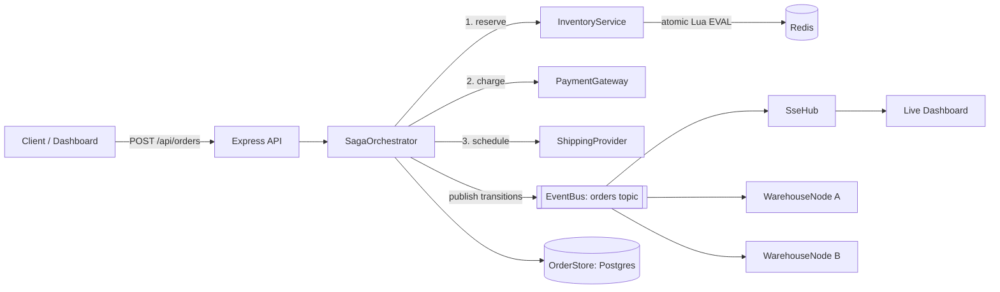

# Architecture

## Why this exists

Most student "supply chain management system" projects are CRUD over
suppliers/orders/inventory tables. This one is built around the two problems
that actually make supply chain and order-fulfillment systems hard at scale:

1. **Never oversell** — many customers can try to buy the last unit of a SKU
   at the same instant, across multiple app instances. A naive
   read-then-write check-then-decrement is a race condition.
2. **Never leave an order half-finished** — a multi-step fulfillment flow
   (reserve stock, charge payment, schedule shipping) can fail at any step,
   and every already-completed step needs to be unwound cleanly, without a
   distributed transaction coordinator across services that don't share a
   database.

## Components

## The reservation guarantee

`src/inventory/reserve.lua` runs as a single atomic operation on the Redis
server: check available stock, and if sufficient, decrement it and record a
reservation — all inside one `EVAL`. Because Redis executes Lua scripts
single-threaded, every concurrent caller (from any number of app instances,
each with its own connection) is serialized through that one check-and-
decrement, so it's structurally impossible for two reservations to both
succeed against the same last unit. `scripts/verify.ts` proves this directly:
500 concurrent reservation attempts against 50 units of stock accept exactly
50 and reject exactly 450, every time, from 10 independent connections
simulating 10 separate app instances.

Every reservation carries a TTL (`reserve.lua`'s `ARGV[3]`), so a crashed
order-service instance that reserved stock but never confirmed or released it
doesn't lock that stock forever — Redis expires the reservation key and the
next `release`/`commit` call against it becomes a safe no-op.

## The saga

`src/orders/sagaOrchestrator.ts` implements an **orchestration-style saga**:
one coordinator (`SagaOrchestrator.run`) calls each participant in sequence
and explicitly compensates already-completed steps if a later step fails.

| Step completed          | If a later step fails, compensation runs |
|--------------------------|-------------------------------------------|
| Inventory reserved        | `InventoryService.release()` — returns stock to the pool |
| Payment charged           | `PaymentGateway.refund()` |
| Shipping scheduled        | `ShippingProvider.cancel()` |

Compensations run in reverse order of completion, and every compensating
action is idempotent (`release.lua` is a no-op on an already-resolved
reservation; `refund()` is a no-op if nothing was charged), so a crash
mid-rollback and a subsequent retry can't double-refund or double-release.

Orchestration (vs. choreography, where services react to each other's events
with no central coordinator) was the right call here because the whole point
is a single order's audit trail being easy to reconstruct: `order.history` on
every `Order` is literally the saga's event log for that order.

## Multi-warehouse eventual consistency

`src/warehouse/warehouseSync.ts` models each warehouse as an independent node
consuming a shared stock-events log through its own consumer-group cursor —
the same mechanism Kafka consumer groups give you for free. A disconnected
node (simulating a network partition, a deploy, or an AZ outage) simply stops
advancing its cursor; on reconnect it replays every event it missed, in
order, and converges to the same state as every node that stayed connected,
with no event lost or double-applied.

## Swappable infrastructure, not fake infrastructure

Two seams keep this repo runnable in two very different environments without
touching business logic:

- **Redis**: `RedisLike` is implemented by `RawRespClient` (a ~150-line
  zero-dependency RESP client over `node:net`, used by default and by
  `scripts/verify.ts`) and by `IoRedisClient` (a thin wrapper over `ioredis`,
  used when `REDIS_DRIVER=ioredis`). Both talk to a real Redis server —
  there's no mock in the reservation path.
- **Events**: `EventBus` is implemented by `InMemoryEventBus` (real
  consumer-group semantics, in-process — what the test suite and
  `scripts/verify.ts` use) and by `KafkaEventBus` (a thin wrapper over
  `kafkajs`, used when `KAFKA_BROKERS` is set).

This is why the whole correctness story — no overselling, clean saga
rollback, multi-node convergence — can be verified with nothing but Node and
a local `redis-server`, while the same code path runs against real Kafka and
managed Redis in `docker-compose.yml` / production.

## Deployment topology (Kubernetes)

`k8s/base/app-deployment.yaml` runs the app with 2+ replicas by default —
not an arbitrary default, but the actual point of the project: the
no-oversell guarantee is only interesting if it holds *across* multiple
concurrently-running instances, which is exactly what
`tests/concurrency.load.test.ts` and `scripts/verify.ts`'s "multi-instance"
check exercise. Redis/Postgres/Kafka are network-isolated from everything
except the app tier via `NetworkPolicy`, Postgres and Kafka run as
`StatefulSet`s with their own `PersistentVolumeClaim`s (stable identity +
durable storage, unlike the interchangeable pods a `Deployment` gives you),
and the app's readiness probe checks real Redis connectivity so a pod with a
temporarily unreachable dependency is pulled out of Service rotation instead
of being killed and restarted. Full rundown in [`k8s/README.md`](../k8s/README.md).
